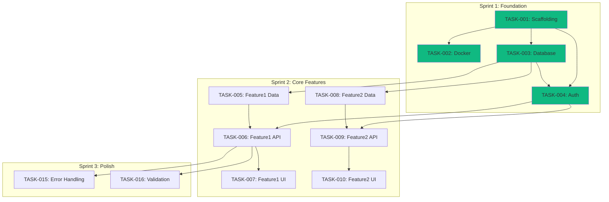

# ProdReady Plan (Phase 3: PLAN)

Break down the implementation into actionable tasks with dependencies.

**Estimated time**: ~15 minutes

**Prerequisites**: Complete `/prodready.design` and pass `/prodready.gate design`

## Instructions

Analyze the define and design artifacts to create a detailed implementation plan.

### Prerequisites Check

1. Verify `.prodready/define/` exists with user stories
2. Verify `.prodready/design/` exists with architecture and API spec
3. Create plan directory:
   ```
   .prodready/plan/
   ```

---

## Step 1: Create Implementation Strategy

Read and synthesize:
- User stories from `.prodready/define/requirements/user-stories.md`
- Architecture from `.prodready/design/architecture/pattern.md`
- Tech stack from `.prodready/design/architecture/tech-stack.md`
- API spec from `.prodready/design/api/openapi.yaml`

Generate `.prodready/plan/implementation-plan.md`:

```markdown
# Implementation Plan

## Overview

Project: [Name from vision.md]
Pattern: [From pattern.md]
Stack: [Key technologies]

## Phases

### Phase 1: Foundation (Sprint 1)
**Goal**: Project setup and infrastructure
- Project scaffolding
- Database setup
- Authentication foundation

### Phase 2: Core Features (Sprint 2-3)
**Goal**: Implement MVP features
- [Core feature 1]
- [Core feature 2]
- [Core feature 3]

### Phase 3: Integration (Sprint 4)
**Goal**: Connect and polish
- API integration
- Error handling
- Basic UI polish

## Risks & Mitigations

| Risk | Impact | Mitigation |
|------|--------|------------|
| [Risk 1] | High | [Mitigation] |
| [Risk 2] | Medium | [Mitigation] |

## Dependencies

External dependencies:
- [ ] [Service/API access]
- [ ] [License/account needed]
```

---

## Step 2: Generate Backlog

Break down each user story into implementation tasks.

### Task Sizing Rules

- Each task should be < 4 hours of work
- Each task should be independently testable
- Each task should produce a commit-worthy change

### Task Structure

Generate `.prodready/plan/backlog.md`:

```markdown
# Implementation Backlog

## Sprint 1: Foundation

### TASK-001: Project Scaffolding
**Priority**: P0 | **Estimate**: 2h | **Status**: Ready

**Description**:
Initialize Next.js project with TypeScript, ESLint, Prettier, and base configuration.

**Acceptance Criteria**:
- [ ] Next.js 15 with App Router initialized
- [ ] TypeScript strict mode enabled
- [ ] ESLint + Prettier configured
- [ ] Base folder structure created (src/app, src/lib, src/types)
- [ ] Git initialized with .gitignore

**Blocked by**: None
**Blocks**: TASK-002, TASK-003, TASK-004

---

### TASK-002: Docker Setup
**Priority**: P0 | **Estimate**: 2h | **Status**: Ready

**Description**:
Create Docker configuration for development and production.

**Acceptance Criteria**:
- [ ] Dockerfile with multi-stage build
- [ ] docker-compose.yml for development
- [ ] docker-compose.prod.yml for production
- [ ] .dockerignore configured
- [ ] App runs in container

**Blocked by**: TASK-001
**Blocks**: None

---

### TASK-003: Database Setup
**Priority**: P0 | **Estimate**: 2h | **Status**: Ready

**Description**:
Configure PostgreSQL with Prisma ORM.

**Acceptance Criteria**:
- [ ] PostgreSQL in docker-compose
- [ ] Schema from .prodready/define/data-model/schema.* applied
- [ ] Initial migration created
- [ ] Database connection working
- [ ] Seed file created

**Blocked by**: TASK-001
**Blocks**: TASK-005

---

### TASK-004: Authentication Setup
**Priority**: P0 | **Estimate**: 3h | **Status**: Ready

**Description**:
Implement user authentication system.

**Acceptance Criteria**:
- [ ] User model in Prisma schema
- [ ] Register endpoint POST /api/auth/register
- [ ] Login endpoint POST /api/auth/login
- [ ] JWT token generation and validation
- [ ] Password hashing with bcrypt
- [ ] Protected route middleware

**Blocked by**: TASK-003
**Blocks**: TASK-006, TASK-007

---

## Sprint 2: Core Features

### TASK-005: [Feature 1] - Data Layer
**Priority**: P0 | **Estimate**: 2h | **Status**: Ready

**Description**:
Implement data access layer for [Feature 1].

**Acceptance Criteria**:
- [ ] Prisma model defined
- [ ] Migration applied
- [ ] Repository/service with CRUD operations
- [ ] Unit tests for service

**Blocked by**: TASK-003
**Blocks**: TASK-006

---

### TASK-006: [Feature 1] - API Endpoints
**Priority**: P0 | **Estimate**: 3h | **Status**: Ready

**Description**:
Implement REST API endpoints for [Feature 1].

**Acceptance Criteria**:
- [ ] GET /api/[resource] - list with pagination
- [ ] POST /api/[resource] - create
- [ ] GET /api/[resource]/:id - get by id
- [ ] PUT /api/[resource]/:id - update
- [ ] DELETE /api/[resource]/:id - delete
- [ ] Input validation with Zod
- [ ] Integration tests for all endpoints

**Blocked by**: TASK-005, TASK-004
**Blocks**: TASK-010

---

### TASK-007: [Feature 1] - UI Components
**Priority**: P1 | **Estimate**: 3h | **Status**: Ready

**Description**:
Create UI components for [Feature 1].

**Acceptance Criteria**:
- [ ] List view component
- [ ] Create/Edit form component
- [ ] Detail view component
- [ ] Loading and error states
- [ ] Component tests

**Blocked by**: TASK-006
**Blocks**: TASK-011

---

[Continue for all features from user stories...]

---

## Sprint 3: Polish & Integration

### TASK-015: Error Handling
**Priority**: P1 | **Estimate**: 2h | **Status**: Ready

**Description**:
Implement global error handling.

**Acceptance Criteria**:
- [ ] Error boundary component
- [ ] API error response format
- [ ] Toast notifications for errors
- [ ] Error logging

**Blocked by**: TASK-006
**Blocks**: None

---

### TASK-016: Input Validation
**Priority**: P1 | **Estimate**: 2h | **Status**: Ready

**Description**:
Add comprehensive input validation.

**Acceptance Criteria**:
- [ ] Zod schemas for all inputs
- [ ] Client-side validation
- [ ] Server-side validation
- [ ] Validation error messages

**Blocked by**: TASK-006
**Blocks**: None

---

## Task Summary

| Sprint | Tasks | Total Estimate |
|--------|-------|----------------|
| Sprint 1 | TASK-001 to TASK-004 | 9h |
| Sprint 2 | TASK-005 to TASK-014 | 25h |
| Sprint 3 | TASK-015 to TASK-020 | 12h |
| **Total** | **20 tasks** | **46h** |
```

---

## Step 3: Create Dependency Graph

Generate visual dependency map.

`.prodready/plan/dependencies.mmd`:



---

## Step 4: Create Test Plan

Define testing strategy.

`.prodready/plan/test-plan.md`:

```markdown
# Test Plan

## Testing Strategy

### Test Pyramid

```
        /\
       /  \  E2E (10%)
      /----\
     /      \  Integration (30%)
    /--------\
   /          \  Unit (60%)
  /-----------\
```

## Unit Tests

**Coverage Target**: 80%+

| Module | What to Test |
|--------|--------------|
| Services | Business logic, validation |
| Utils | Helper functions |
| Components | Render, interactions |

**Framework**: Vitest
**Location**: `tests/unit/`

## Integration Tests

**What to Test**:
- API endpoints (request → response)
- Database operations
- Authentication flow

**Framework**: Vitest + Supertest
**Location**: `tests/integration/`

### API Test Cases

```markdown
### Auth Endpoints
- [ ] POST /api/auth/register - success
- [ ] POST /api/auth/register - duplicate email
- [ ] POST /api/auth/register - invalid email
- [ ] POST /api/auth/login - success
- [ ] POST /api/auth/login - wrong password
- [ ] POST /api/auth/login - non-existent user

### [Resource] Endpoints
- [ ] GET /api/[resource] - list (authenticated)
- [ ] GET /api/[resource] - unauthorized
- [ ] POST /api/[resource] - create success
- [ ] POST /api/[resource] - validation error
- [ ] GET /api/[resource]/:id - found
- [ ] GET /api/[resource]/:id - not found
- [ ] PUT /api/[resource]/:id - success
- [ ] DELETE /api/[resource]/:id - success
```

## E2E Tests

**What to Test**:
- Critical user flows
- Happy paths from test scenarios

**Framework**: Playwright
**Location**: `tests/e2e/`

### E2E Scenarios

Map from `.prodready/define/test-scenarios/*.feature`:

```markdown
- [ ] User registration and login
- [ ] [Critical flow 1]
- [ ] [Critical flow 2]
```

## Test Data

### Fixtures

```typescript
// tests/fixtures/users.ts
export const testUser = {
  email: 'test@example.com',
  password: 'Test123!@#'
}
```

### Seed Data

Use Prisma seed for consistent test data.

## CI Integration

Tests run on every PR:
1. Lint check
2. TypeScript check
3. Unit tests
4. Integration tests (with test DB)
5. E2E tests (with test environment)

## Traceability

| User Story | Feature File | E2E Test |
|------------|--------------|----------|
| US-001 | auth.feature | auth.spec.ts |
| US-002 | [feature].feature | [feature].spec.ts |
```

---

## Step 5: Scaffold Readiness

Before proceeding to implementation, development infrastructure must be scaffolded.

After this gate passes, the workflow is:
1. `/prodready.gate plan` — validate plan artifacts
2. `/prodready.scaffold` — create dev environment (Docker, CI, Makefile)
3. `/prodready.gate scaffold` — validate infrastructure
4. `/prodready.implement` — start coding inside containers

---

## Final Output

```
╔═══════════════════════════════════════════════════════════╗
║              Phase 3: PLAN Complete                       ║
╠═══════════════════════════════════════════════════════════╣
║                                                           ║
║  Created:                                                 ║
║  ├── .prodready/plan/implementation-plan.md              ║
║  ├── .prodready/plan/backlog.md                          ║
║  ├── .prodready/plan/dependencies.mmd                    ║
║  └── .prodready/plan/test-plan.md                        ║
║                                                           ║
║  Summary:                                                 ║
║  • [N] Tasks defined                                      ║
║  • [M] Sprints planned                                    ║
║  • Estimated: [X] hours                                   ║
║                                                           ║
╚═══════════════════════════════════════════════════════════╝

➤ Next: /prodready.gate plan
(After gate: /prodready.scaffold → /prodready.gate scaffold → /prodready.implement)
```

---

## Tips

- Tasks should be small enough to complete in one session
- Include "ready" criteria - what's needed before starting
- Include "done" criteria - acceptance criteria for completion
- Dependencies help parallelization when working with team
